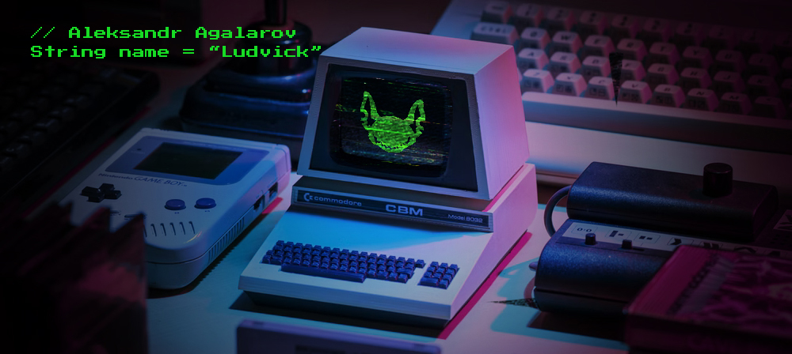
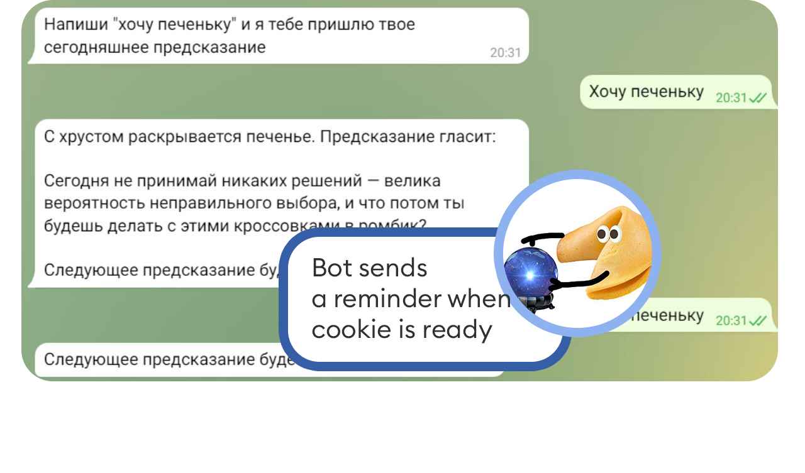
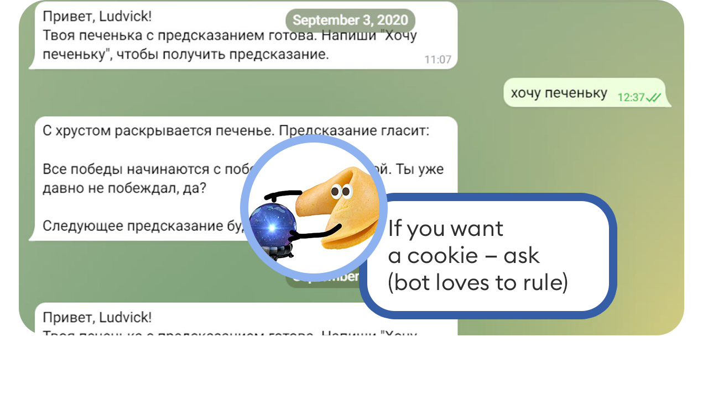
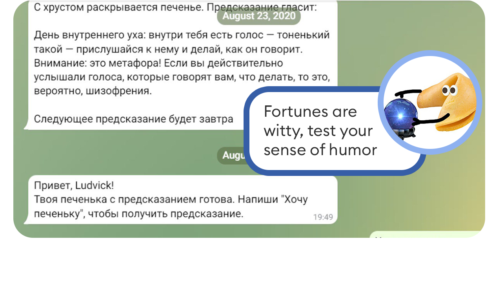
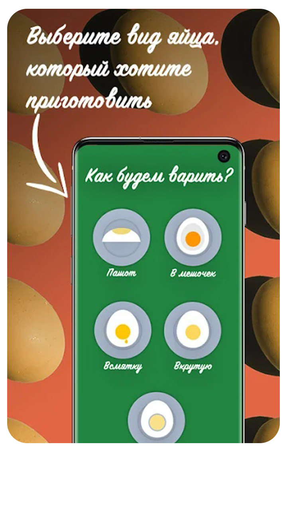

About me 👾
---------------------

Hi! My name is Aleksandr and i'm Java developer. I'm worked 8 years in gaming industry as manual tester and game designer. After that I radically changed my profession at the 30 age. I learned programming on my own and now worked in Sber (Lead IT company in Russia). I write scripts, stubs, emulators. A little more about me: 
*   🌱 started career at gamedev as QA (manual testing)
*   ☕️ i have more than 3 yeras of experience with Java
*   📲 in my free time I create applications for Google Play and bots for messanges
*   🎮 i really love video games

Languages and Tools 💻
---------------------

Often use:

      
      
      
      
      
      
      
      
      
      
      
      

Rarely used:

      
      
      
      
      

My projects 🎱
---------------------

      
      
      

  

        <strong>Fortune Pechenka Bot</strong>
  

  

        <em>Link: https://t.me/FortunePechenka_bot</em>
  

  

        
About: telegram-bot, that sends one message per day and tell user his fortune! 

  

      
      

  

        <strong>Egg Master</strong>
  

  

        <em>Link: https://play.google.com/store/apps/details?id=me.ludvick.eggtimer</em>
  

  

        
About: Tired of imperfect eggs? With the Egg Master app, your eggs will be exactly the way you want them to be. Namely: in a bag, hard-boiled, soft-boiled and even poached! 

  

 

Special thanks 🫀 
---------------------

Readme.md customize help links:

<ul>
  <li>https://dev.to/supritha/how-to-have-an-awesome-github-profile-1969</li>
  <li>https://github.com/anuraghazra/github-readme-stats#top-languages-card</li>
  <li>https://github.com/antonkomarev/github-profile-views-counter</li>
  <li>https://worldvectorlogo.com/</li>
  <li>https://github.com/marwin1991/profile-technology-icons#communication</li>
</ul>
